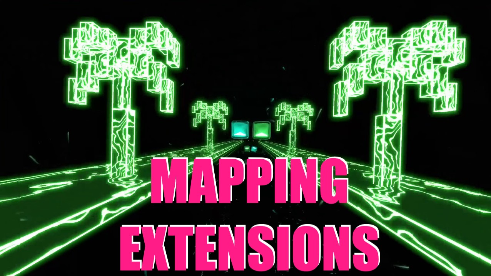

Mapping Extensions for Quest
============================

Mapping Extensions adds a host of new things you can do with your maps as a mapper, and allows you to play said maps as a player.

This mod was originally created by [Kyle 1413](https://github.com/Kylemc1413/MappingExtensions) and previously maintained by Micheal Zoller, now maintained by [StackDoubleFlow for Quest](https://github.com/StackDoubleFlow/QuestMods/tree/master/MappingExtensions). 

## Settings

No settings are required.

## Credits

* Libraries: [QuestUI](https://github.com/darknight1050/questui), [beatsaber-hook](https://github.com/sc2ad/beatsaber-hook), [codegen](https://github.com/sc2ad/BeatSaber-Quest-Codegen), [custom-types](https://github.com/sc2ad/Il2CppQuestTypePatching)
